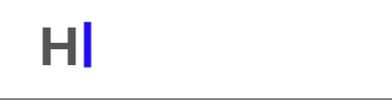
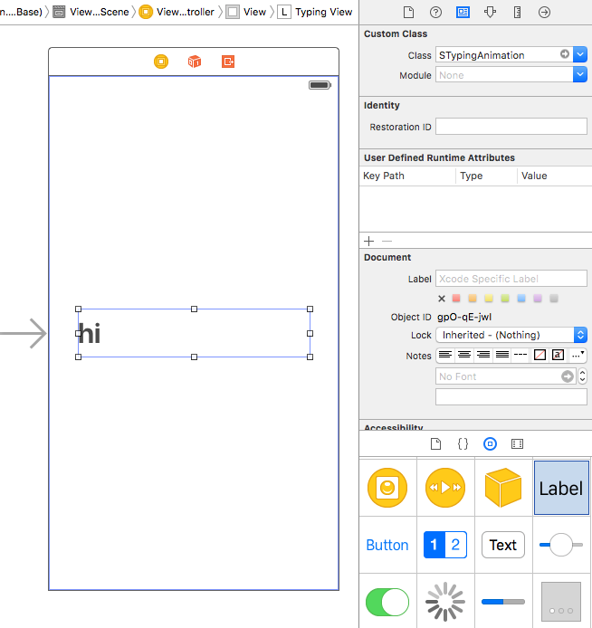

STypingAnimation
===============

[](https://developer.apple.com/ios/)
[](https://developer.apple.com/reference/objectivec)
[](https://github.com/azurechen/ACTabScrollView/blob/master/LICENSE.md)

A fully customizable Objective-C typing animation view that mimics auto-typing in `UITextField`.

DEMO
----




Installation
------------

####CocoaPods

This method is still not ready yet.

####Manual

1. Drag these two files into your project.

  * `STypingAnimation.h`
  * `STypingAnimation.m`

Usage
------------

####Interface Builder:
  
1. Drag a `UILabel` object from the Object Library and drop it in your Storyboard.

2. Set the `Class` to `STypingAnimation` in your Identity Inspector.

  

3. Link your `IBOutlet` to your class as a property
  
  ```objective-c
  @property (weak, nonatomic) IBOutlet STypingAnimation *typingView;
  ```
    
4. Import the header file into your desired class *(view controller)*.

  ```objective-c
  #import "STypingAnimation.h"
  ```
  
5. Set the array of texts that you want to display by adding this code to `viewDidLoad` for example.
    
    ```objective-c
    [self.typingView setTextArray:@[@"Hello World!",@"It's working!"]];
    ```

    That's it, run the project and see the results!
    
####Programatically

1. Import the header file into your desired class *(view controller)*.

  ```objective-c
  #import "STypingAnimation.h"
  ```
  
2. Create an instance of `STypingView` and provide it with your array of texts you want to display. Don't forget to add that subview to a view like below.
   
    ```objective-c
    STypingAnimation *typingView = [[STypingAnimation alloc] initWithTextArray:@[@"Hello World!",@"It's working!"]];
  [self.view addSubview:typingView];
    ```
    
    That's it, just run the project and enjoy!
    
Customization
-------------

Assuming that you have a `typingView` object, you can do a lot of adjustment to the speed/effect of your animated label by modifying one of the following public properties:

####Typing speed
The speed of typing a letter measured in seconds. 

```objective-c
self.typingView.typingSpeed = 0.5;
```

####Cursor blink speed
The time (in seconds) that it takes the cursor to perform a full blink (appear & disappear completely).

```objective-c
self.typingView.cursorBlinkSpeed = 0.5;
```

####Delay to start typing
The time (in seconds) that the label waits before starting to type.

```objective-c
self.typingView.startTypingDelay = 0.5;
```

####Delay to start deleting
The time (in seconds) that the label waits before starting to delete characters.

```objective-c
self.typingView.delayToStartDeleting = 0.5;
```

####Delay to start deleting
The time (in seconds) that the label waits before starting to delete characters.

```objective-c
self.typingView.deletingSpeed = 0.1;
```

####Loop the animation
A boolean that states if the animation should stop or repeat when all the texts in the array gets typed out.

```objective-c
self.typingView.loop = YES;
```

License
-------

The MIT License (MIT)

Copyright (c) 2016 Saily

Permission is hereby granted, free of charge, to any person obtaining a copy
of this software and associated documentation files (the "Software"), to deal
in the Software without restriction, including without limitation the rights
to use, copy, modify, merge, publish, distribute, sublicense, and/or sell
copies of the Software, and to permit persons to whom the Software is
furnished to do so, subject to the following conditions:

The above copyright notice and this permission notice shall be included in all
copies or substantial portions of the Software.

THE SOFTWARE IS PROVIDED "AS IS", WITHOUT WARRANTY OF ANY KIND, EXPRESS OR
IMPLIED, INCLUDING BUT NOT LIMITED TO THE WARRANTIES OF MERCHANTABILITY,
FITNESS FOR A PARTICULAR PURPOSE AND NONINFRINGEMENT. IN NO EVENT SHALL THE
AUTHORS OR COPYRIGHT HOLDERS BE LIABLE FOR ANY CLAIM, DAMAGES OR OTHER
LIABILITY, WHETHER IN AN ACTION OF CONTRACT, TORT OR OTHERWISE, ARISING FROM,
OUT OF OR IN CONNECTION WITH THE SOFTWARE OR THE USE OR OTHER DEALINGS IN THE
SOFTWARE.
